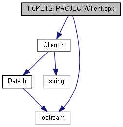

Документация за Билетния центът   0.0.1

Автор: Николай Желязков

Кратко описание
===============

Конзолоното приложение представлява списък от команди, чрез които можем
да си правим покупки и продажби на билети за дадено събитие както и да
си създаваме събитие, и още много други неща

Изглед на началното меню: {style="display:block; text-align:center;padding:10px; font-weight:bold;"}
-------------------------

-   Open
-   Help
-   Save
-   Save\_as
-   Close
-   Exit

* * * * *

Open {style="display:block; text-align:center;padding:10px; font-weight:bold;"}
----

В секцията open потребителя избира файл с данни, който съществува и след
това според това дали е Клиент или Модератор може да работи с функциите,
които са показани в help.

* * * * *

Help {style="display:block; text-align:center;padding:10px; font-weight:bold;"}
----

В секцията help потребителя може да разбере с какви функции може да
разполага в билетния център, като според това дали е клиент или
модератор има различни функции

* * * * *

Save {style="display:block; text-align:center;padding:10px; font-weight:bold;"}
----

В секцията save потребителя просто записва данните в директорията на
отворения файл

* * * * *

Save as {style="display:block; text-align:center;padding:10px; font-weight:bold;"}
-------

В секцията save as потребителя просто записва данните в нова директория
с име, което той избере

* * * * *

Close {style="display:block; text-align:center;padding:10px; font-weight:bold;"}
-----

В секцията close потребителя затваря отворения файл без да го запазва и
вече може да отваря нов такъв с командата open

* * * * *

Exit {style="display:block; text-align:center;padding:10px; font-weight:bold;"}
----

В секцията Exit потребителя спира приложението.

* * * * *

За в бъдеще {style="display:block; text-align:center;padding:10px; font-weight:bold;"}
-----------

Проекта е още ранна версия. В бъдеще ще може да се пишат имена на
събития, които да са с повече от една дума. Ако има други бъгове, те
също ще бъдат оправени.

\

За повече информация прегледайте останалите страници
====================================================
